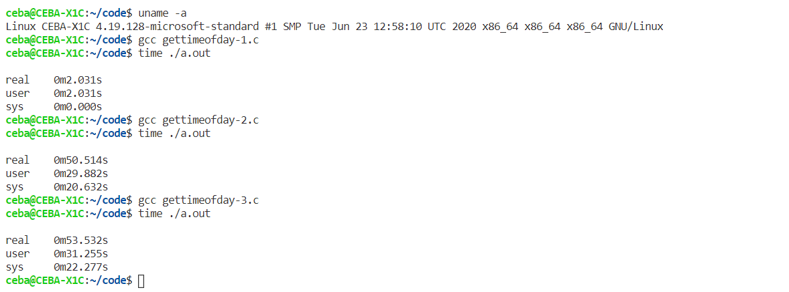

# 操作系统 作业 2

### 题目
Linux 下常见的3种系统调用方法包括有：
1. 通过 `glibc` 提供的库函数
2. 使用 `syscall` 函数直接调用相应的系统调用
3. 通过 `int 80` 指令陷入（`32bit`）或者通过 `syscall` 指令陷入（`64bit`）

请研究 `Linux`(`kernel>=2.6.24`) `gettimeofday` 这一系统调用的用法，并且选择上述 3 种系统调用方法中的 2 种来执行，记录其运行时间。

提示：请思考一次系统调用的时间开销的量级，对比结果，并尝试解释其中原因。 

提交内容： 程序、执行结果、结果分析、系统环境（`uname -a`) ，本人学号。

### 解答
* 基本思路：重复 `100000000` 次系统调用，使用 `time` 命令记录时间。
* 系统环境：
  ```shell
  $ uname -a
  Linux CEBA-X1C 4.19.128-microsoft-standard #1 SMP Tue Jun 23 12:58:10 UTC 2020
  x86_64 x86_64 x86_64 GNU/Linux
  ```
1. 通过 `glibc` 提供的库函数：
   * 源代码：
   ```c
   #include <unistd.h>
   #include <sys/syscall.h>
   #include <sys/time.h>
   #include <stdio.h>

   #define MAX_TIMES 100000000

   int main() {
       struct timeval tv;
       for (int i = 0; i < MAX_TIMES; i++) {
           gettimeofday(&tv, NULL);
       }
       return 0;
   }
   ```
   * 运行结果：
   ```shell
   $ time ./a.out

   real    0m2.031s
   user    0m2.031s
   sys     0m0.000s
   ```
2. 使用 `syscall` 函数直接调用相应的系统调用
   * 源代码：
   ```c
   #include <unistd.h>
   #include <sys/syscall.h>
   #include <sys/time.h>
   #include <stdio.h>

   #define MAX_TIMES 100000000

   int main() {
       struct timeval tv;
       for (int i = 0; i < MAX_TIMES; i++) {
           syscall(SYS_gettimeofday, &tv, NULL);
       }
       return 0;
   }
   ```
   * 运行结果：
   ```shell
   $ time ./a.out 

   real    0m50.514s
   user    0m29.882s
   sys     0m20.632s
   ```
3. 通过 `int 80` 指令陷入（`32bit`）或者通过 `syscall` 指令陷入（`64bit`）
   * 源代码：
   ```c
   #include <unistd.h>
   #include <sys/syscall.h>
   #include <sys/time.h>
   #include <stdio.h>

   // #define MAX_TIMES 1
   #define MAX_TIMES 100000000

   int main() {
       struct timeval tv;
       for (int i = 0; i < MAX_TIMES; i++) {
           asm volatile (
               "movq   %[syscall_id], %%rax \n"
               "movq   %[tv_addr], %%rdi \n"
               "movq   %[tz_addr], %%rsi \n"
               "syscall \n"
               :
               : [syscall_id] "i" (SYS_gettimeofday),
                 [tv_addr] "r" (&tv),
                 [tz_addr] "r" (NULL)
               : "rax", "rdi", "rsi"
           );
           // printf("time: %ld", tv.tv_sec);
       }
       return 0;
   }
   ```
   * 运行结果：
   ```shell
   $ time ./a.out 

   real    0m53.532s
   user    0m31.255s
   sys     0m22.277s
   ```
* 结果分析：可以注意到，第 2、3 种方法的执行时间相近，用户态与内核态用时比例也相似；而第 1 种方法的执行时间远小于后两种，而且几乎没有内核态时间。可以猜测，第 2 种方法中 `syscall` 函数的实现与第 3 种方法高度相似，利用软中断实现系统调用。而第 1 种方法，`gettimeofday` 函数的实现可能采用了一些方法，避免了重复进行系统调用，使得其速度较快。

附件：运行截图  
