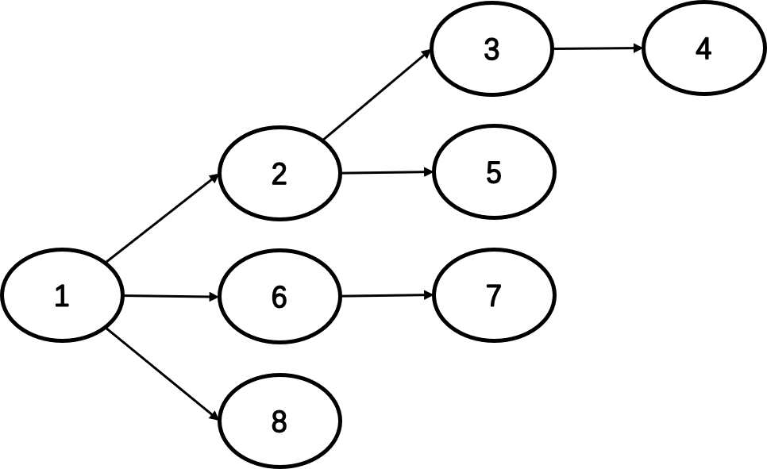

# 操作系统 作业 3

## 一、描述
以下代码为 Linux/Unix 创建进程的例子，其中
* fork 克隆出一个进程
* exec覆盖掉当前进程

```cpp
if ((pid = fork()) == 0) {
    /* child process */
    exec("foo");    /* does not return */
} else {
    /* parent */
    wait(pid);      /* wait for child to die */
}
```
### 作业要求
请大家阅读 xv6 源码，撰写一份分析报告。报告需要给出以下信息：
1. 在 xv6 中，PCB 信息是如何表示的？是用什么数据结构？存放在哪个文件中？
2. 上述代码中，修改了哪些 PCB 中的信息？

### 解答
在 xv6 中，PCB 信息用 `proc` 结构体表示，这个结构体的定义在 `proc.h` 文件中。其定义如下：
```c
struct proc {
  uint sz;                     // Size of process memory (bytes)
  pde_t* pgdir;                // Page table
  char *kstack;                // Bottom of kernel stack for this process
  enum procstate state;        // Process state
  int pid;                     // Process ID
  struct proc *parent;         // Parent process
  struct trapframe *tf;        // Trap frame for current syscall
  struct context *context;     // swtch() here to run process
  void *chan;                  // If non-zero, sleeping on chan
  int killed;                  // If non-zero, have been killed
  struct file *ofile[NOFILE];  // Open files
  struct inode *cwd;           // Current directory
  char name[16];               // Process name (debugging)
};
```
* `sz`：进程占用的内存空间大小（以字节记）；
* `pgdir`：进程的页表；
* `kstack`：进程的内核栈栈底；
* `state`：进程的状态，为未使用（`UNUSED`），准备（`EMBRYO`），睡眠（`SLEEPING`），就绪（`RUNNABLE`），运行（`RUNNING`），僵尸（`ZOMBIE`）六种状态之一。
* `pid`：进程的编号。
* `parent`：进程父进程。
* `tf`：当前系统调用的陷阱帧。
* `context`：切换进程时保存的寄存器，包含 `edi`、`esi`、`ebx`、`ebp`、`eip` 五个寄存器。
* `chan`：如果非零，则使该进程睡眠，保存至此指针指向的地址。
* `killed`：如果非零，则该进程已经被杀死。
* `ofile`：打开的文件。
* `cwd`：当前目录。
* `name`：进程名称，用于 debug。

上述代码中，`fork`、`exec`、`wait` 三个函数对进程进行了操作。`fork`、`wait` 定义在 `proc.c`，`exec` 定义在 `exec.c`。

`fork` 函数用于创建进程。它主要对新建的子进程的 PCB 进行了修改：
* 从当前进程的页表中复制内容到新的页表，并将新的页表赋值给 `pgdir`；
* 指定 `sz` 与父进程相同；
* 指定 `parent` 为父进程；
* 将父进程的 `tf` 拷贝到子进程，并清零 `tf` 中的 `eax`；
* 指定 `ofile`、`np`、`name` 与父进程相同；
* 指定 `state` 为 `RUNNABLE`。

`wait` 函数用于等待子进程结束。它首先找到一个父进程是当前进程且处于 `ZOMBIE` 状态的子进程，而后对子进程的 PCB 进行修改：
* 释放内核栈；
* 将 `pid`、`parent`、`name`、`killed` 置为 0；
* 将 `state` 改为 `UNUSED`。

`exec` 函数用于加载并执行一个文件。它主要对当前进程的 PCB 进行了修改：
* 将文件名保存为进程名 `name`；
* 指定 `pgdir` 为新获得的页表；
* 指定 `sz` 为加载的文件大小；
* 指定 `tf` 中的 `eip` 和 `esp` 为 ELF 的入口和栈顶；

## 进程创建
```cpp
int main() {
    pid_t pid;
    int i;
    for (i = 0; i < 3; i++) {
        /*fork another process*/
        pid = fork();
        if (pid < 0) {
            /*error occurred*/
            fprintf(stderr, "ForkFailed");
            exit(-1);
        } else if (pid==0) {
            /*child process*/
            fprintf(stdout, "i = %d, pid = %d, parentpid = %d\n", 
                i, getpid(), getppid());
        }
    }
    wait(NULL);
    exit(0);
}
```
请问该程序最终一共生成几个进程？假设当前进程 PID 为 1，生成的进程 PID 依次加 1，请将生成进程关系图画出来。

### 解答
总共生成 8 个进程，关系图如下：

