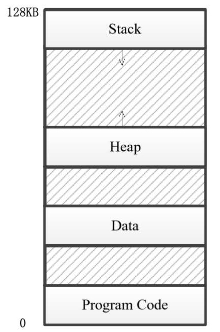

# 操作系统 作业 9

## 1
某机器提供 128 KB 的地址空间，4 个段，代码段位于最低地址空间，其次是数据段、堆和栈，且栈位于最高地址空间，向下增长，如图所示。



1. 虚地址为多少二进制位？每个段最大为多少 KB？每个段的起始虚地址是多少？
2. 假设一个进程被加载到物理内存，其段表如下。
   | Seg  | Base       | Size | Grow |
   | :--- | :--------- | :--- | :--- |
   | 0    | `0x100000` | 2 KB | 1    |
   | 1    | `0x180000` | 2 KB | 1    |
   | 2    | `0x240000` | 3 KB | 1    |
   | 3    | `0x200000` | 4 KB | 0    |

   请问以下虚地址对应的物理地址分别为多少？
   * `0x12ec4`
   * `0x1f362`
   * `0x0b600`
   * `0x1a850`

### 解

1. 虚地址空间为 128 KB，那么虚地址应当为 17 位（2<sup>17</sup> = 128 × 1024）；

   总计 4 个段，将占用虚地址中高 2 位作为段号。那么每个段最大为 2<sup>15</sup> B = 32 KB。

   每个段的起始虚地址如下：
   |   段   | 起始虚地址 | 增长方向 |
   | :----: | :--------- | :------: |
   |   栈   | `0x1ffff`  |   向下   |
   |   堆   | `0x10000`  |   向上   |
   | 数据段 | `0x08000`  |   向上   |
   | 代码段 | `0x00000`  |   向上   |

2. 如下：
   * `0x12ec4` 在堆中，其相对于起始虚地址的偏移量为 `0x12ec4` - `0x10000` = `0x2ec4`；
     
     那么 `0x12ec4` 的物理地址为 `0x2ec4` + `0x240000` = `0x242ec4`。

   * `0x1f362` 在栈中，其相对于起始虚地址的偏移量为 `0x1f362` - `0x1ffff` = -`0x0c9d`；
     
     栈对应的 3 段起始地址为 `0x200000`，大小为 4 KB，那么其结尾地址为 `0x200fff`；

     那么 `0x1f362` 的物理地址为 -`0x0c9d` + `0x200fff` = `0x200362`。

   * `0x0b600` 在数据段中，其相对于起始虚地址的偏移量为 `0x0b600` - `0x08000` = `0x3600`；

     那么 `0x0b600` 的物理地址为 `0x3600` + `0x180000` = `0x183600`。

   * `0x1a850` 在栈中，其相对于起始虚地址的偏移量为 `0x1a850` - `0x1ffff` = -`0x57af`；

     然而分配给栈的大小仅为 4 KB，显然 `0x57af` 大于了最大偏移量 `0x0fff`，故其溢出，无对应的物理地址。

## 2
Suppose that a machine has 48-bit virtual addresses and 32-bit physical addresses.

1. If pages are 4 KB, how many entries are in the page table if it has only a single level? Explain.
2. Suppose this same system has a TLB (Translation Lookaside Buffer) with 32 entries. Futhermore, suppose that a program contains instructions that fit into one page and it sequentially reads long integer elements from an array that spans thousands of pages. How effective will the TLB be for this case.

### Solution

1. The size of virtual memory space is 2<sup>48</sup> B；
   
   If pages are 4 KB, or 2<sup>12</sup> B, then there are 2<sup>48</sup> ÷ 2<sup>12</sup> = 2<sup>36</sup> entries in the page table.
   
2. For instruction: 
   * Fetching the first instruction will cause a TLB miss.
   * Since all instruction fit into one page, there will not be any TLB miss after the first instruction.
   
   For data:
   * As the size of pages is 4 KB, one page contains 512 long intergers (64-bit).
   * Reading the first long interger in a page will cause a TLB miss. Sequentially reading the remaining 511 long intergers will not cause TLB miss.
   * As the array spans thousands of pages, the whole reading process will cause thousands of TLB miss.

## 3
Consider the following C program:
```c
int X[N];
int step = M;   /* M is some predefined constant */
for (int i = 0; i < N; i += step) X[i] = X[i] + 1;
```

1. If this program is run on a machine with a 4-KB page size and 64-entry TLB, what values of `M` and `N` will cause a TLB miss for every execution of the inner loop?
2. Would you answer in part 1 be different if the loop were repeated many times? Explain.

### Solution

1. `M` should be 1024, `N` can be any value:
   * As the size of pages is 4 KB, one page contains 1024 intergers (32-bit).
   * In order to cause a TLB miss for every execution of the inner loop, the loop body should access a new page.
   * Hence `step`, or `M`, should be 1024, which makes `X[i]` be in different page in two sequential execution of the loop.
   * There is no restriction of `N`.

2. `M` should be 1024, `N` should be greater than 65536 (2<sup>16</sup>):
   * The requirement of `M` is same as part 1.
   * Every loop should overwrite the whole TLB, otherwise there would not be TLB miss in first several execution of the inner loop. 
   <!-- * To overwrite TLB, the array `X` should span over 64 pages, at least 65 pages. In other words, the size of `X` should be at least 65 × 4 KB = 260 KB, `X` should contain more than 65 × 1024 = 66560 intergers.
   * Hence `N` should be greater than 66560 (65 × 2<sup>10</sup>). -->
   * To overwrite TLB, the access of `X` should over 64 times, at least 65 times. In other words, `N` should be at least 65 × `M`.
   * Hence `N` should be greater than 65 `M`.

## 4
A computer has 32-bit virtual addresses and 4-KB pages. The program and data together fit in the lowest page (0-4095). The stack fits in the highest page. How many entries are needed in the page table if traditional (one-level) paging is used? How many page tables entries are needed for two-level paging, with 10 bits in each part?

### Solution

If traditional (one-level) paging is used:
* The size of virtual memory space is 2<sup>32</sup> B = 2<sup>22</sup> KB.
* As the size of pages is 4 KB, there will be 2<sup>22</sup> ÷ 4 = 2<sup>20</sup> pages
* Hence 2<sup>20</sup> entries are needed.

If two-level paging is used:
* The first page table needs 2<sup>10</sup> entries, as 10 bits in each part of two-level paging.
* one second page table needs 2<sup>10</sup> entries.
* As the lowest page and the highest page are used, 2 of first page table entries are used, which means 2 second page table are needed.
* Hence 3 × 2<sup>10</sup> entries are needed.

## 5
A computer whose processes have 1024 pages in their address spaces keeps its page tables in the memory. The overhead required for reading a word from the page table is 5 nsec. To reduce this overhead, the computer has a TLB, which holds 32 (virtual page, physical page frame) pairs, and can do a lookup in 1 nsec. What hit rate is needed to reduce the mean overhead to 2 nsec?

## Solution

Suppose the hit rate is $h$.

The average time is $1 \times h + 5 \times (1 - h)$ (nsec).

According to the requirement, we have
$$
1 \times h + 5 \times (1 - h) \leq 2
$$

So we get $h \geq 0.75$.

Hence hit rate need to be greater than $0.75$.